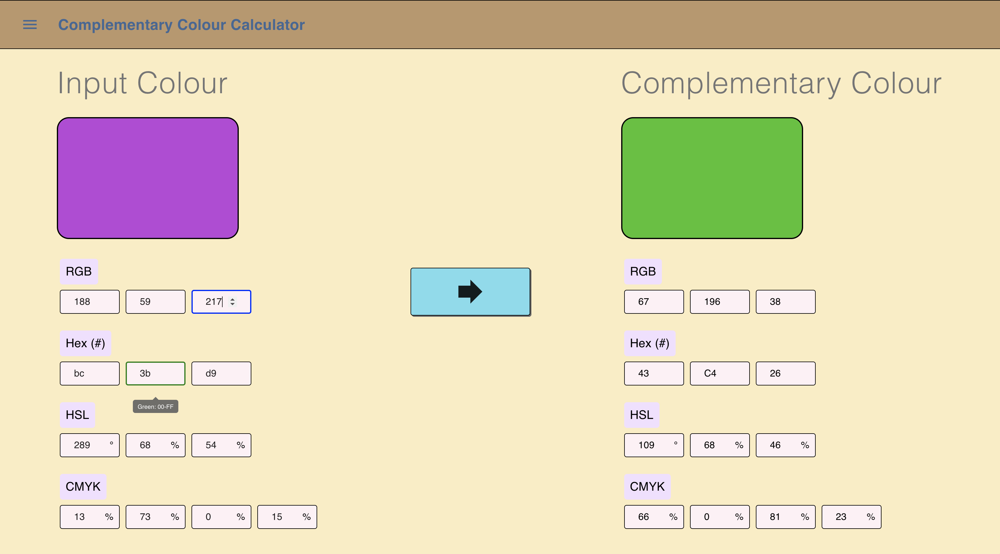

# Complementary Colours

React web app that takes an input colour, calculates the complementary colour and displays the output to the user.

Live demos available at:
https://akthao.github.io/complementary-colours/
and
https://complementary-colours.herokuapp.com
